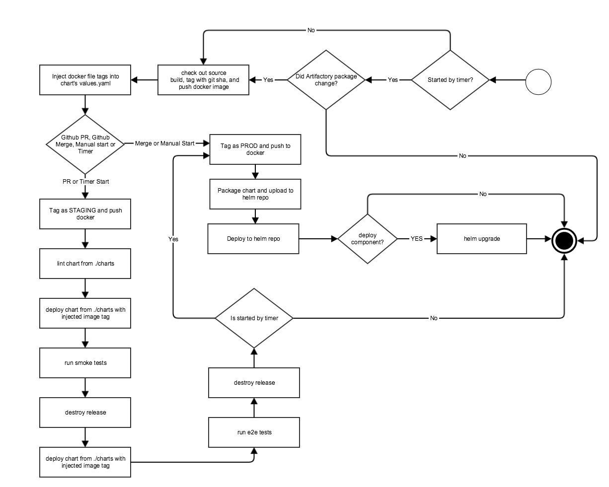

# Table of Contents

<!-- MarkdownTOC depth=3 autolink=true bracket=round -->

- [CNCT shared workflow library](#cnct-shared-workflow-library)
  - [Configuration files](#configuration-files)
    - [settings.groovy](#settingsgroovy)
    - [pipeline.groovy](#pipelinegroovy)
  - [Shared workflow library](#shared-workflow-library)
  - [Application GitHub repositories](#application-github-repositories)
    - [Required project layout](#required-project-layout)
    - [Jenkinsfiles](#jenkinsfiles)
    - [Helm charts](#helm-charts)
    - [Helm charts and Docker image updates](#helm-charts-and-docker-image-updates)
    - [Dockerfiles](#dockerfiles)
    - [Application tests](#application-tests)
  - [Pipeline flow implemented in this library](#pipeline-flow-implemented-in-this-library)

<!-- /MarkdownTOC -->
# CNCT shared workflow library

The [shared workflow library](https://jenkins.io/doc/book/pipeline/shared-libraries/) in this repository is a library of reusable Groovy code, that is reused my multiple jenkins jobs/pipelines in order to test, and deploy Kubernetes Helm - based applictions. A full CNCT pipeline consists of:

* configuration files written in the Groovy language, stored in a separate org-specific git repo.
* this shared workflow library
* Helm chart GitHub repositories

## Configuration files
All pipeline configuration files are described in below sections in detail. *They live in a separate, organization-specific repository.*

### settings.groovy
The `settings.groovy` file defines global settings used by all application pipelines.

```
#!/usr/bin/groovy
def getConfig() {
  def config = [
    githubOrg: 'myorg',                                         // Github organization for source repositories
    slackOrg: 'myorg',                                          // Slack organization for notifications
    dockerRegistry: 'gcr.io/my-project',                        // docker registry base name
    pipelineRepo: 'my-pipeline',                                // Name of repo under githubOrg that contains settings.groovy and pipeline.groovy
    pipelineLibGithubOrg: 'samsung-cnct',                       // Shared global lilbrary github organization
    pipelineLibRepo: 'cnct-pipeline-library',                   // Shared global library repository name
    githubCredentials: 'ssh-key',                               // Jenkins credentials id for the primary ssh keypair
    githubScanCredentials: 'repo-scan-access',                  // Jenkins credentials id for github username/password (or token)
    slackCredentials: 'slack-token',                            // Jenkins credentials id for slack API token
    daysToKeep: 14,                                             // keep old builds for x days
    githubAdmin: 'my-bot',                                      // Github id of Jenkins bot
    githubWebhooks: true,                                       // Use Github webhooks for PR and master builds 
    seedJobName: 'seed',                                        // Name of the seed Jobdsl job
    seedJobToken: 'seed',                                       // script token for the Jobdsl job
    dslRunnerNode: 'jobdsl',                                    // label of the Jenkins executor reserved for jobdsl runs
    artifactory: 'artifactory.myorg.net',                       // URL of the target artifactory
    chartRepo: 'http://helmrepo.prod.svc.cluster.local/charts', // Cluster DNS name for the Helm chart repository
    maxRetry: 3,                                                // Retry failed operations x times
    chartBucket: 'gs://myorg-helmrepo'                          // GS storage bucket for the Helm chart repository
  ]
  return config
}

return this;
```

### pipeline.groovy
The `pipeline.groovy` file defines each of the application pipelines 

Setting | Description
--- | --- | ---
desc | Description of the application
pipeline | The name of the pipeline in Jenkins
repo | The GitHub repository from where the application is downloaded 
slack | Slack channel for notifications
helm | The application name as deployed by Helm. This is the value shown by the `helm list` command.
deploy | Specifies whether the application should be deployed as the final step of the pipeline.
smoketest | Specifies whether smoke testing should be attempted


For example:

```
#!/usr/bin/groovy
def getConfig() {
  def config = [
    ...

    myapp: [
      desc: 'my app',
      pipeline: 'my-app-pipeline', 
      repo: 'my-app',
      slack: '#ping-org',
      helm: 'myapp',
      deploy: true,
      smoketest: false
    ],
    myapptwo: [
      desc: 'my app two',
      pipeline: 'my-app-two-pipeline', 
      repo: 'my-app-two',
      slack: '#ping-org',
      helm: 'myapptwo',
      deploy: true,
      smoketest: true
    ],

    ...
  ]
  return config
}

return this;
```

## Shared workflow library

The [shared workflow library](https://jenkins.io/doc/book/pipeline/shared-libraries/) in this repository is a library of reusable Groovy code, that is reused my multiple jenkins jobs/pipelines.

## Application GitHub repositories

This workflow library expects each Helm-packaged application to be in its own GitHub repository. These repositories contain Dockerfiles that build Docker images of applications and Kubernetes Helm charts that describe how these Docker images are to be deployed into a GKE cluster.

Each application repository follows a standard file and directory layout. The location and names of some of the folders are significant, and serve to integrate the various parts of the pipeline.

### Required project layout
Each application repository must have the structure outlined below. The pipeline requires a `charts` directory for dependent Helm charts and a `rootfs` directory for dependent Docker iamges. The name of the subdirectory under rootfs must match the chart name defined in `Chart.yaml`.

All application repositories follow the same directory structure, as shown in this example for an application named `appname`:

```
charts\
  <chart>-a/
    ...
  <chart>-n/
    ...
rootfs\
  <appname>-component-a/
    Dockerfile
    Makefile               // optional
    ...
  <appname>-component-n/
    Dockerfile
    Makefile               // optional
    ...
test/                      // optional
  e2e/                     // optional
    <appname>_e2e_suite_test.go
    <appname>_e2e_test_go
Jenkinsfile
```

### Jenkinsfiles
A `Jenkinsfile` is a text file that contains the definition of a [Jenkins Pipeline](https://jenkins.io/doc/book/pipeline/). Each application repository contains a single `Jenkinsfile` in the root directory. Each `Jenkinsfile` will instantiate and run an `ApplicationPipeline`-based workflow.

The following is an example of a Jenkinsfile:

```
#!/usr/bin/env groovy
@Library('pipeline')
import net.cnct.pipeline.ApplicationPipeline

applicationPipeline = new ApplicationPipeline(
  steps, 
  'myapp', 
  this,
  'https://github.com/myorg/my-pipeline.git',
  'my-creds',
  [
    myapp: [
      staging: [
        'service.nodePort': 30202
      ],
      prod: [
        'service.nodePort': 30102
      ]
    ]
  ],
  [
    'serviceUrl': 'myapp-e2e.staging.svc.cluster.local'
    'servicePort': 9277
  ]
)
applicationPipeline.init()
applicationPipeline.pipelineRun()

```

This `Jenkinsfile` will import a [shared pipeline library](https://jenkins.io/doc/book/pipeline/shared-libraries/) defined as `pipeline`:

```
@Library('pipeline')
import net.cnct.pipeline.ApplicationPipeline
```

And then instantiate a `ApplicationPipeline` class from the imported library, and run it:

```
applicationPipeline.init()
applicationPipeline.pipelineRun()
```

Parameters for the `ApplicationPipeline` class constructor are:

```
applicationPipeline = new ApplicationPipeline(
  steps,                                                // Jenkins pipeline 'steps' object for this instance, required
  'myapp',                                              // Name of this application pipeline as defined in pipeline.groovy, required
  this,                                                 // This 'script' object, required
  'https://github.com/myorg/my-pipeline.git',           // github repository that contains settings.groovy and pipeline.groovy files
  'repo-scan-access',                                   // jenkins credentials id with access to pipeline github repository
  [:],                                                  // Dictionary of values overrides for helm charts, per chart under /charts, per environment, optional. These are expanded to helm '--set key=value,key=value...key=value' format
  [:]                                                   // Dictionary of values to be passed to ginkgo e2e tests as --key=value, optional
)
```

### Helm charts
[Helm](https://github.com/kubernetes/helm) is used to manage applications in Kubernetes. A [chart](https://github.com/kubernetes/helm/blob/master/docs/charts.md) is a collection of files that describe a related set of Kubernetes resources. Each application repository contains a `charts` directory with one or more subfolders with [Helm charts](https://github.com/kubernetes/helm/blob/master/docs/charts.md) that describe all of the Kubernetes resources required for that application.

The following shows the file layout for an application chart:

```
myapp/
  charts/
    myapp/
      README.md
      Chart.yaml
      requirements.yaml
      values.yaml
      templates/
        ...
  ...
  Jenkinsfile
```

### Helm charts and Docker image updates

Each Helm chart has a `values.yaml` file, which contains the default configuration values for the chart. For example:

```
replicaCount: 1
serverName: myserver.mydomain.com
images:
  myapp : gcr.io/my-project/myapp:prod
...
```

In order for this Application Pipeline to build, tag and update docker image values for any chart the `images` section *MUST* be structured as above. I.e:

* They must have a top level `images` stanza
* Under `images` stanza there should be pairs of '_dockerfile folder name under rootfs_' : '_registry path/dockerfile folder name under rootfs_ : _tag_'
* Helm chart templates can then refer to these values as `{{ .Values.images.imagename }}`. For example: `{{ .Values.images.myapp }}` 

For example, given the following images stanza there must be a `Dockerfile` under `./rootfs/myapp/Dockerfile`, as described in the [Dockerfiles](#dockerfiles) section: 

```
images:
  myapp: gcr.io/my-project/myapp:prod
```

### Dockerfiles
The application Docker images are built according to the Dockerfile files in the respective directories in the `rootfs` directory. Some applications have multiple components and consequentially multiple Dockerfile instances.

The directory for a given Dockerfile is specified in the `images:` section of the `values.yaml` file. For example, the following lines in `charts/my-app-name/values.yaml` indicate that the Dockerfile for the app is `rootfs/my-app-name/Dockerfile`.
```
...
images:
    my-app-name: gcr.io/my-project/my-app-name:some-tag
```

### Application tests
Each application repository will, optionally, have two types of tests: Smoke tests and End-to-End tests. Both run on an open pull request to the application repository. Both kinds of tests are written in Golang using the[ginkgo](https://github.com/onsi/ginkgo) library, [gomega](http://onsi.github.io/gomega/) matchers and [agouti](http://agouti.org/) webdriver.

Smoke tests are tests are defined as standard helm [chart tests](https://github.com/kubernetes/helm/blob/master/docs/chart_tests.md).

End-to-End tests are defined as follows:

```
myapp/
  charts/
    mychart/
      ...
  test/
    e2e/
      <test sources.go>
  ...
  Jenkinsfile
```

## Pipeline flow implemented in this library

